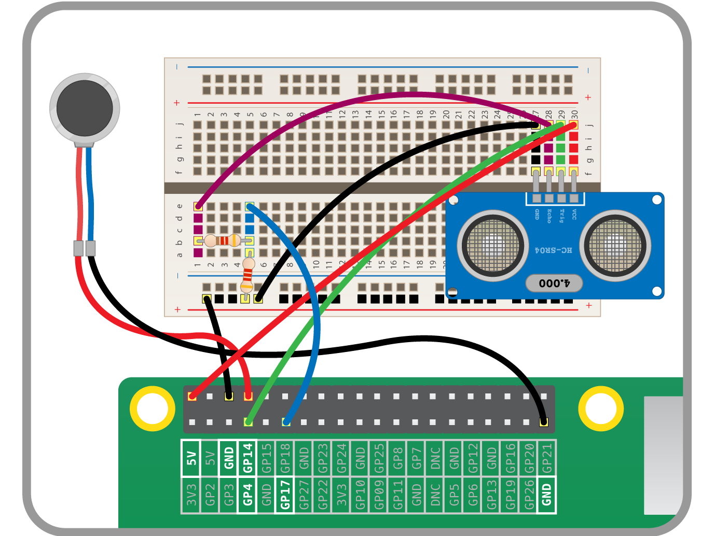

## Adding the Vibration motor

You can now add your vibration motor to GPIO 14 and a ground pin:



- You'll want to drive the motor using Pulse Width Modulation (PWM); this will send pulses of current to the motor. The faster the pulse, the quicker the motor will vibrate. Alter your code to use the `PWMOutputDevice` from `gpiozero` and set up the motor on GPIO 14:

    ```python
    from gpiozero import InputDevice, OutputDevice, PWMOutputDevice
    from time import sleep, time

    trig = OutputDevice(4)
    echo = InputDevice(17)
    motor = PWMOutputDevice(14)

    sleep(2)

    ```

- A `PWMOutputDevice` needs a floating point number between 0 and 1, so you need to remap the distance to a value between 0 and 1. At a maximum of 4m you want a value of 0, while at a distance of 2cm you want a value of 1. You can remap the maximum and minimum distances to minimum and maximum values using the equation below:

    

- Now we can plug in the maximum and minimums:

   

- And finally simplify the equation a little:

   

- Turning this into a Python function you get:

    ```python
    def calculate_vibration(distance):
        vibration = (((distance - 0.02) * -1) / (4 - 0.02)) + 1
        return vibration

    ```

- Finally, you can alter your `while` loop to drive the motor:

    ```python
    while True:
        duration = get_pulse_time()
        distance = calculate_distance(duration)
        vibration = calculate_vibration(distance)
        motor.value = vibration

    ```

Run the code and move your hand closer to and further away from the sensor. The motor should vibrate according to the distance your hand is away from it.

