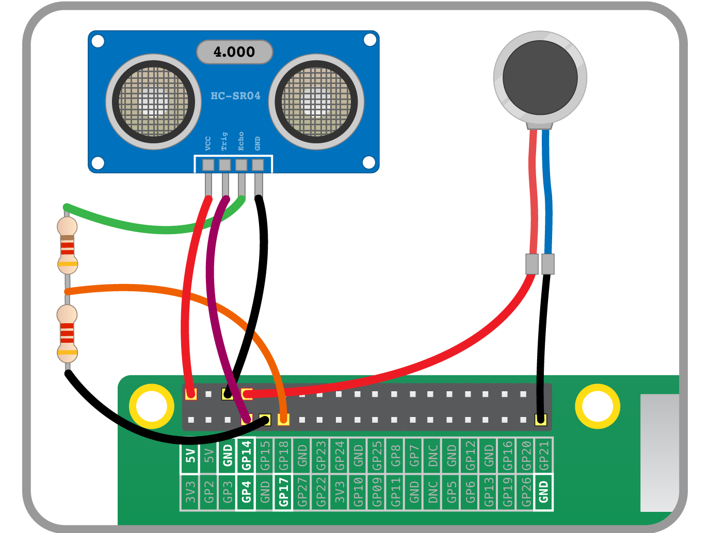

## Κάνοντάς το ανθεκτικό

- Το πρώτο πράγμα που πρέπει να κάνεις είναι να κολλήσεις το ζεύγος αντιστάσεων μαζί και στη συνέχεια να προσθέσεις θηλυκά καλώδια jumper σε κάθε άκρο του ζεύγους. Προσθέσε ταινία ή θερμοσυστελλόμενη ταινία για να ασφαλίσεις και να μονώσεις τις συνδέσεις:

    

- Στη συνέχεια, προσθέσε μια τρίτη θηλυκή κεφαλίδα στη σύνδεση μεταξύ των δύο αντιστάσεων. Αυτό μπορεί στη συνέχεια να μονωθεί με ταινία επίσης:

    

    1. Το καλώδιο που συνδέεται με τη μικρότερη από τις δύο αντιστάσεις πρέπει να συνδεθεί στον ακροδέκτη Echo του UDS.
    1. Το καλώδιο που υπάρχει μεταξύ των δύο αντιστάσεων πρέπει να συνδεθεί στο GPIO 17
    1. Το καλώδιο που βγαίνει από τη μεγαλύτερη από τις δύο αντιστάσεις πρέπει να περάσει σε μια ακίδα γείωσης στο Raspberry Pi.
    1. Όλες οι άλλες συνδέσεις είναι ίδιες με τις προηγούμενες ρυθμίσεις.

- Οι ακροδέκτες της κεφαλής πρέπει επίσης να συνδεθούν με τον κινητήρα δόνησης:

    

- Τέλος, μπορείς να τα συνδέσεις όλα με το Raspberry Pi ή ακόμη καλύτερα με το Pi Zero:

    

Αυτό το διάγραμμα καλωδίωσης μπορεί να σε βοηθήσει:

Εκτέλεσε το σενάριο`bat.py ` για να ελέγξεις ότι όλα λειτουργούν σωστά. Αν δεν λειτουργεί όπως αναμένεται, ρίξε μια ματιά στην ενότητα εντοπισμού σφαλμάτων στο [previous worksheet](worksheet.md).

