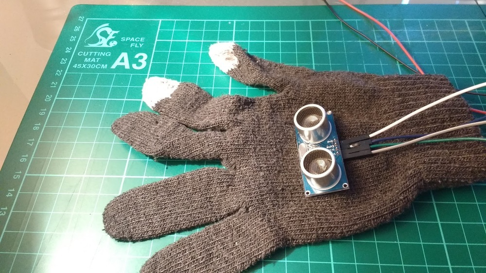
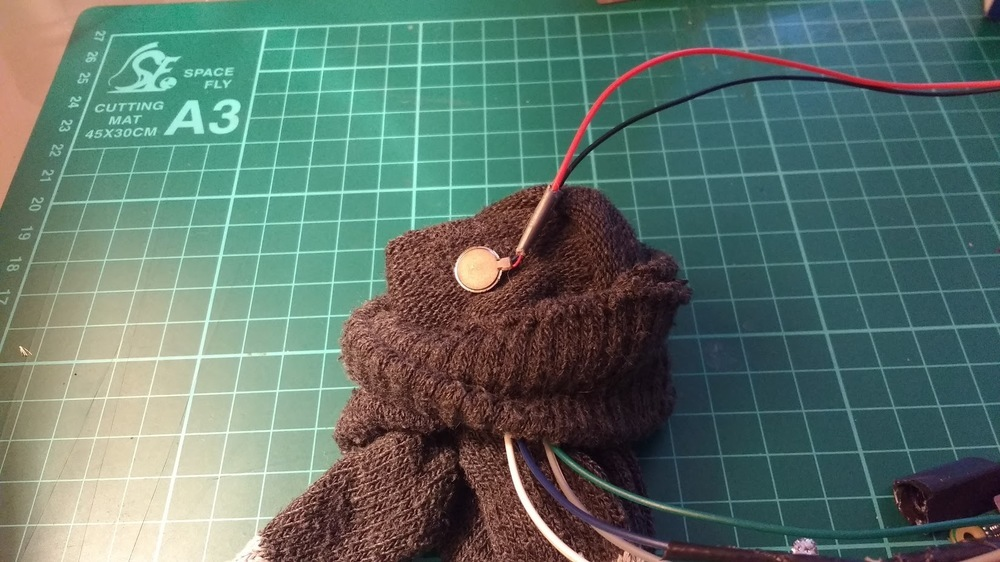
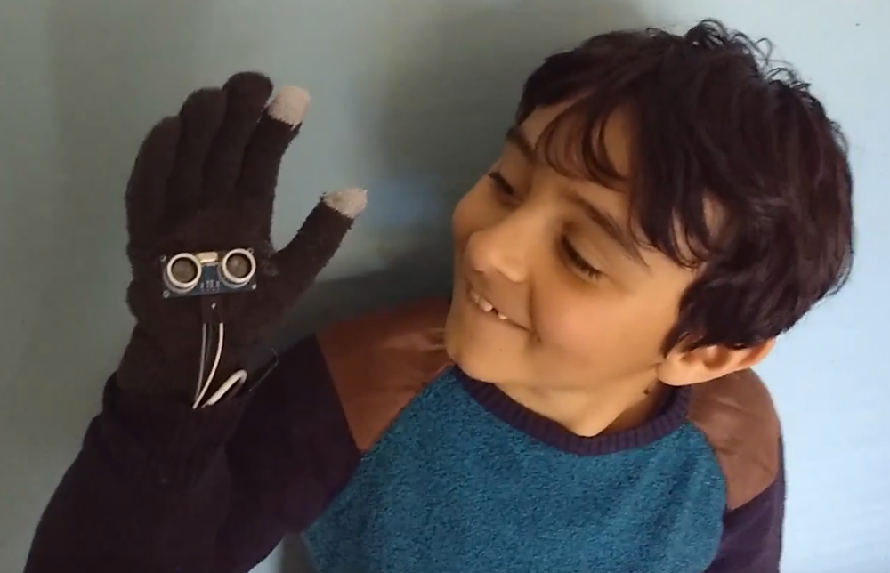

## Κάνοντάς το φορετό

Για να τελειώσεις, μπορείς να κάνεις τη συσκευή σου φορετή.

- Ράψε ή κόλλησε το UDS στην μέσα μεριά ενός γαντιού:

    

- Ράψε ή κόλλησε το μοτέρ δονήσεων στο εσωτερικό του γαντιού, έτσι ώστε να εφάπτεται στην παλάμη:

    

- Τοποθέτησε το Raspberry Pi ή Pi Zero στον καρπό σου, μαζί με μια μπαταρία, και ασφάλισέ το με μια ζώνη καρπού.

    

Τώρα θα πρέπει να είσαι σε θέση να κινήσεις το χέρι σου και να ανιχνεύσεις αντικείμενα που έρχονται κοντά σου ή ότι άλλο πλησιάζεις.

