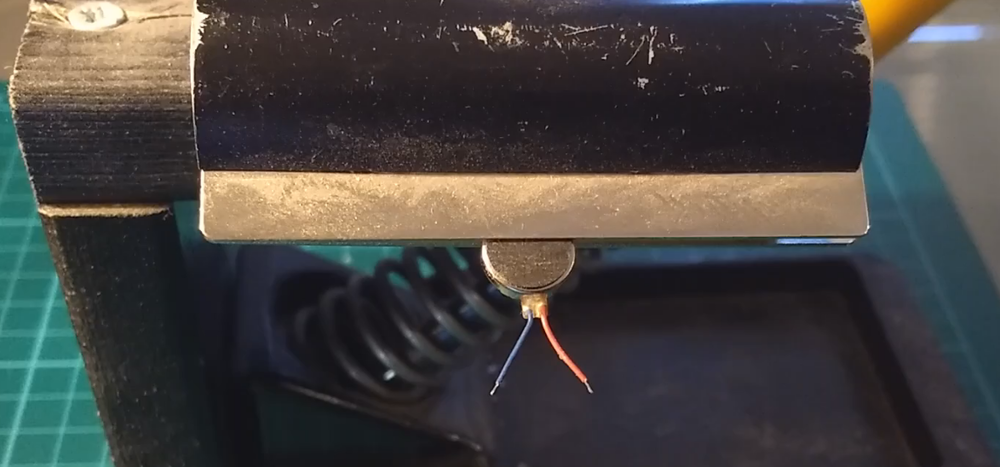
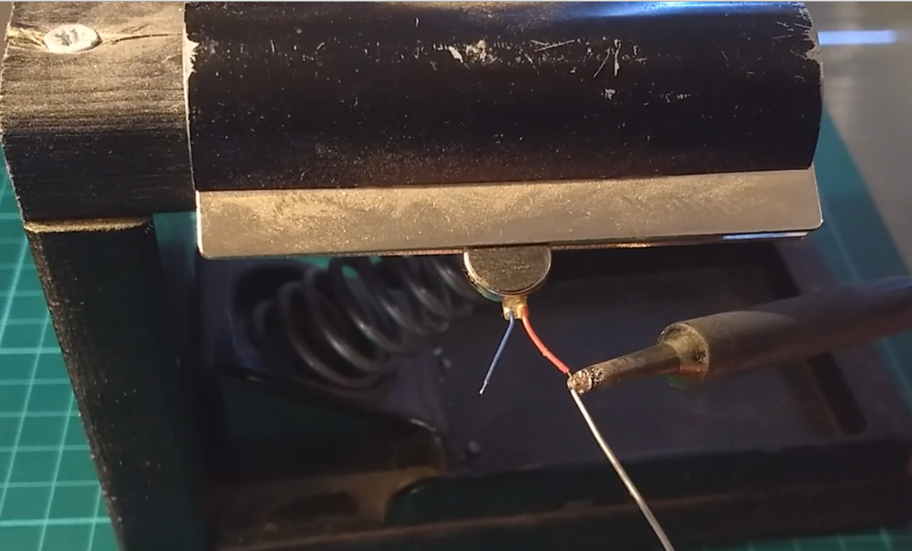
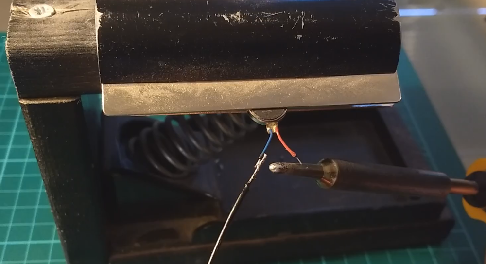
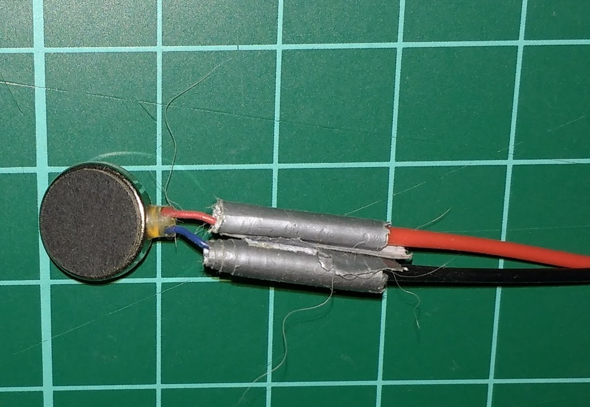

## Προσθήκη καλωδίων επέκτασης στον κινητήρα κραδασμών

Οι πιθανότητες είναι ότι ο κινητήρας δόνησης που έχετε αγοράσει (ή ανακυκλώσει) θα έχει ένα ζευγάρι πολύ μικρών αγωγών που βγαίνουν από αυτόν. Έτσι, το πρώτο πράγμα που πρέπει να κάνετε είναι να συνδέσετε κάποια μεγαλύτερα καλώδια. Αυτό είναι συνήθως πιο εύκολο να πραγματοποιηθεί χρησιμοποιώντας ένα κολλητήρι συγκόλλησης, αν και μπορείτε να το αποφύγετε με την συστροφή των συρμάτων μαζί και την ασφάλισή τους με πολλή μονωτική ταινία.

- Πάρτε τον κινητήρα δόνησης και ασφαλίστε τον στη θέση του.

    

- Χρησιμοποιήστε την μύτη του κολλητηριού συγκόλλησης για να θερμάνετε τα άκρα των αγωγών και, στη συνέχεια, εφαρμόστε μια μικρή ποσότητα κόλλησης στα δύο καλώδια έτσι ώστε να καλυφθούν με αυτή. Αυτή είναι γνωστή ως κασσίτερος.

    

- Πάρτε περίπου 60cm κόκκινο και μαύρο πολύκλωνο σύρμα και απογυμνώστε το μονωτικό πλαστικό από τα άκρα του καθενός.

- Στερεώστε τώρα τα άκρα του πολύκλωνου καλωδίου.

- Ασφαλίστε το μοτέρ δονήσεων για άλλη μια φορά, έπειτα αγγίξτε τους αγωγούς του πολύκλωνου σύρματος και εφαρμόστε λίγο θερμότητα για να λιώσετε τη κόλληση με την οποία είναι επικαλυμμένα. Θα πρέπει να ενωθούν μεταξύ τους και να σχηματίσουν έναν ασφαλή δεσμό.

    

- Χρησιμοποιήστε κάποια μονωτική ταινία ή θερμοσυστελόμενο υλικό για να μονώσετε τα δύο καλώδια.

    

