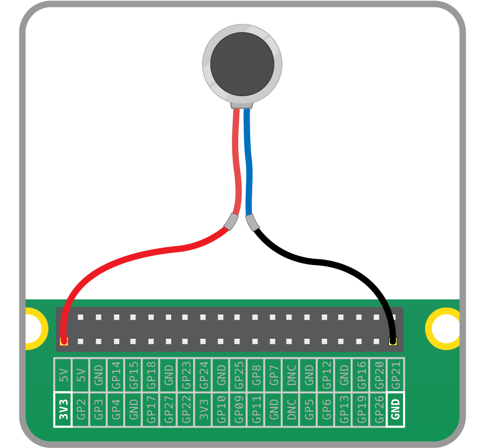

## Δοκιμή του κινητήρα κραδασμών

Θα πρέπει τώρα να δοκιμάσεις τις κολλήσεις (ή τη συστροφή) σας.

- Περιστρέψτε τα ελεύθερα άκρα του πολύκλωνου σύρματος έτσι ώστε να γίνουν αρκετά άκαμπτα.

- Εισαγάγετε αυτά τα άκρα σε αγωγούς ζεύξης θηλυκού-θηλυκού.

- Τοποθετήσε το κόκκινο καλώδιο στην έξοδο 3V3 στο Raspberry Pi.

- Τοποθετήσε το μαύρο καλώδιο σε οποιαδήποτε ακίδα γείωσης.

    

Είναι σημαντικό να σημειώσουμε ότι μπορείς να το κάνεις μόνο με αυτόν τον συγκεκριμένο κινητήρα, καθώς διαρρέεται από πολύ μικρό ρεύμα. Μεγαλύτεροι κινητήρες δεν θα πρέπει ποτέ να συνδέονται απευθείας με τις ακίδες του Raspberry Pi και, αντίθετα, πρέπει να συνδέονται με ένα τσίπ οδήγησης κινητήρα ή ένα τρανζίστορ.

Ο κινητήρας πρέπει να αρχίσει να δονείται, οπότε μπορείς να τον αποσυνδέσεις από το Raspberry Pi.

