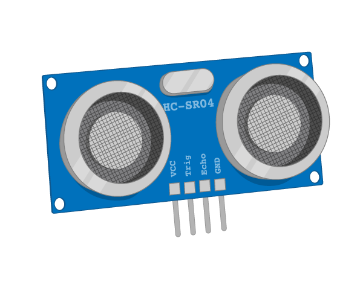

## Πώς λειτουργεί ένας υπερηχητικός αισθητήρας απόστασης (UDS)

Ένας υπερηχητικός αισθητήρας απόστασης (UDS) λειτουργεί με υπερήχους. Αυτοί είναι ήχοι με μια συχνότητα τόσο υψηλή ώστε οι άνθρωποι δεν μπορούν να τους ακούσουν. Οι νυχτερίδες και τα δελφίνια δεν θα είχαν κανένα πρόβλημα, καθώς έχουν εξελιχθεί για να μπορούν να χρησιμοποιούν ήχους αυτής της συχνότητας.

Ο υπερηχητικός αισθητήρας απόστασης λειτουργεί στέλλοντας μια ριπή υπερήχων. Αυτός ο ήχος θα ταξιδέψει μέσω του αέρα, αλλά θα αντανακλαστεί πίσω (echo) από σκληρές επιφάνειες. Ο αισθητήρας μπορεί να ανιχνεύσει την ηχώ, όταν επιστρέψει.

Γνωρίζοντας τον χρόνο μεταξύ της εξερχόμενης ριπής και της ηχούς επιστροφής και της ταχύτητας του ήχου, μπορείς να υπολογίσεις πόσο μακριά είναι ένα αντικείμενο από τον αισθητήρα.

Ένα UDS έχει 4 ακίδες:

1. Vcc is the pin that powers the device. It needs 5V to work.
2. Trig is the pin that sends out the burst. It can be triggered using 3.3V.
3. Echo is the pin that outputs when the reflected sound is received. It outputs at 5V.
4. Gnd is the ground pin, used to complete the circuit.

Εδώ έχουμε ένα πρόβλημα. Ο ακροδέκτης echo πρόκειται να δώσει έξοδο 5V, αλλά το Raspberry Pi σου μπορεί να λάβει μόνο το μέγιστο των 3.3V μέσω οποιουδήποτε από τους ακροδέκτες GPIO. Οπότε για να μην κάψεις το Pi, θα πρέπει να μειώσεις αυτή την τάση εξόδου.

