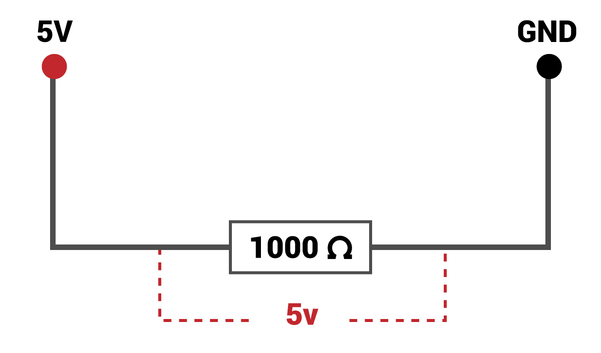
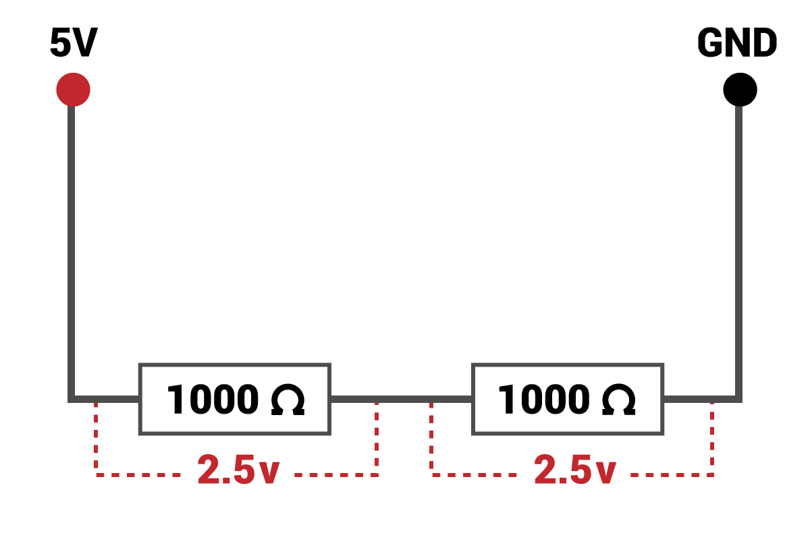
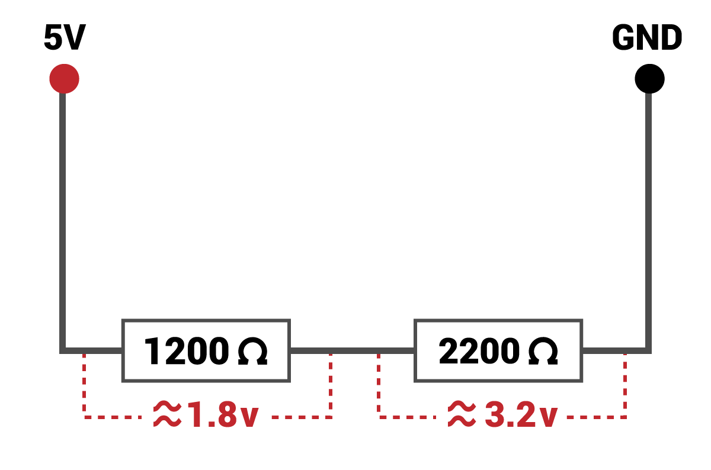

## Διαιρέτες τάσης

Ένας διαιρέτης τάσης μπορεί να χωρίσει μια τάση σε δύο μικρότερες τάσεις. Αυτό γίνεται χρησιμοποιώντας αντιστάτες. Δες το παρακάτω διάγραμμα. Δείχνει έναν μόνο αντιστάτη συνδεδεμένο σε 5V. Η τάση κατά μήκος της αντίσταση είναι 5V:



Δες το παρακάτω διάγραμμα. Χρησιμοποιώντας δύο αντιστάσεις, η τάση μπορεί να χωριστεί. Καθώς και οι δύο αντιστάσεις είναι ίδιες, η τάση διαιρείται εξίσου μεταξύ των δύο:



Αλλάζοντας τις αντιστάσεις, μπορείς να προσαρμόσεις την τάση σε οποιαδήποτε από αυτές για να είναι οτιδήποτε σου αρέσει. Εδώ μπορείς να δείς ότι έχουμε χωρίσει την τάση για να μας δώσει σχεδόν ακριβώς 3.3V:



Για να επεξεργαστείς τις αντιστάσεις που χρειάζεσαι, μπορείς να χρησιμοποιήσεις τον παρακάτω κώδικα ή απλά να χρησιμοποιήσεις τις αντιστάσεις στον υπόλοιπο οδηγό.

```python
R1 = 1200 # Η μικρότερη από τις δύο αντιστάσεις (μεταβάλλεται αυτή)
Vout = 3.3 # Η τάση που προσπαθούμε να επιτύχουμε (πάντα 3.3)
Vin = 5 # Η τάση εισόδου (πάντα 5)

R2 = (Vout * R1) / (Vin - Vout) 

print('Η αντίσταση που χρειάζεστε είναι περίπου', R2)
```

Ο απαιτούμενος αντιστάτης είναι μόνο ένας γενικός οδηγός. Θυμήσου, πραγματικά χρειαζόμαστε μόνο μια τάση πάνω από 1.8V για να πάρουμε ένα λογικό υψηλό σε έναν ακροδέκτη GPIO.

