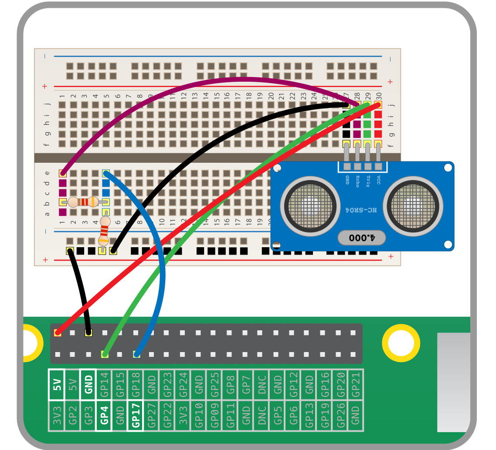

## Καλωδίωση του UDS

Το επόμενο στάδιο είναι η εγκατάσταση και δοκιμή του UDS. Αυτό γίνεται καλύτερα με το Raspberry Pi απενεργοποιημένο, καθώς είσαι έτοιμος να χρησιμοποιήσεις 5V, και εάν βραχυκυκλώσεις κατά λάθος το Pi, μπορεί να έχεις προβλήματα.

- Ξεκίνησε συνδέοντας τον ακροδέκτη 5V του Pi στον ακροδέκτη VCC του UDS.
- Η ακίδα Trig του UDS μπορεί να πάει κατευθείαν στο GPIO 4.
- Η ακίδα Echo στο UDS πρέπει να πάει στην πρώτη αντίσταση του διαιρέτη τάσης.
- Η έξοδος του πρώτου αντιστάτη του διαιρέτη τάσης χρειάζεται να πάει στο GPIO 17.
- Το Gnd από το UDS μπορεί να πάει σε οποιαδήποτε γείωση στο Raspberry Pi.

Το παρακάτω διάγραμμα δείχνει την πλήρη ρύθμιση:

