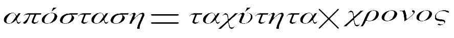

## Υπολογισμός της απόστασης

Υπάρχει μια απλή φόρμουλα για τον υπολογισμό της απόστασης του αισθητήρα από ένα αντικείμενο. Μπορείς να ξεκινήσεις με την εξίσωση ταχύτητας:


Αυτό μπορεί να αναδιαρθρωθεί για να γίνει:



Αλλά πρέπει να θυμάσαι ότι καθώς ο ήχος πρέπει να ταξιδέψει στο αντικείμενο και πάλι πίσω, πρέπει να διαιρέσουμε την υπολογισμένη απόσταση κατά 2. Επομένως:


Η ταχύτητα του ήχου στον αέρα ποικίλει ανάλογα με τη θερμοκρασία και την πίεση του αέρα, αλλά τείνει να είναι γύρω στα 343ms <sup> -1 </sup>.

Αυτό για να το υπολογίσεις μπορείς να γράψεις μια απλή συνάρτηση Python:

```python
def calculate_distance(duration):
    speed = 343
    distance = speed * duration / 2 # Υπολογισμός της απόστασης σε μέτρα
    return distance
```

Για να δοκιμάσεις ότι τα πάντα λειτουργούν, μπορείς να προσθέσεις έναν ατέρμονα βρόχο στο κάτω μέρος του σεναρίου. Η πλήρης λίστα του κώδικά σου θα πρέπει τώρα να είναι ως εξής:

```python
from gpiozero import InputDevice, OutputDevice
from time import sleep, time

trig = OutputDevice(4)
echo = InputDevice(17)

sleep(2)

def get_pulse_time():
    trig.on()
    sleep(0.00001)
    trig.off()

    while echo.is_active == False:
        pulse_start = time()

    while echo.is_active == True:
        pulse_end = time()

    sleep(0.06)

    return pulse_end - pulse_start

def calculate_distance(duration):
    speed = 343
    distance = speed * duration / 2
    return distance

while True:
    duration = get_pulse_time()
    distance = calculate_distance(duration)
    print(distance)
 
```
Εκτέλεσε τον κώδικά σου και θα πρέπει να δείς μια ροή αριθμών, που σου δείχνει την απόσταση από τον αισθητήρα σε μέτρα. Μετακίνησε το χέρι σου πιο κοντά στον αισθητήρα απόστασης.

