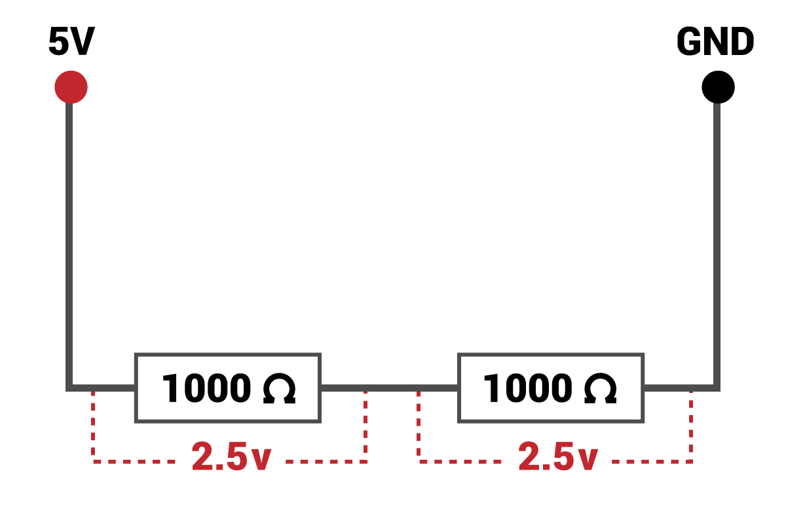
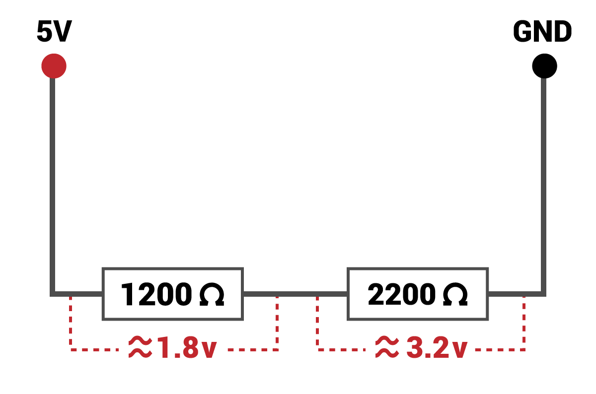

## Potential dividers

A potential divider can split a voltage into two smaller voltages. It does this by using resistors. Look at the diagram below. It shows a single resistor connected to 5V. The voltage across the resistor is 5V:


Now look at the diagram below. By using two resistors, the voltage can be split. As both resistors are the same, the voltage is split equally between the two:



By altering the resistors, we can tailor the voltage across any one of them to be anything we like. Here you can see that we have split the voltage to give us almost exactly 3.3V:



To work out the resistors you need, you can use the code below, or you can just use the resistances in the rest of this guide.

```python
R1 = 1200 # The smaller of the two resistors (alter this)
Vout = 3.3 # The voltage you are trying to achieve (always 3.3)
Vin = 5 # The input voltage (always 5)

R2 = (Vout * R1) / (Vin - Vout) 

print('The resistor you need is approximately',R2)
```

The resistor needed is only a rough guide. Remember, we actually only need a voltage above 1.8V to get a logical high on a GPIO pin.

