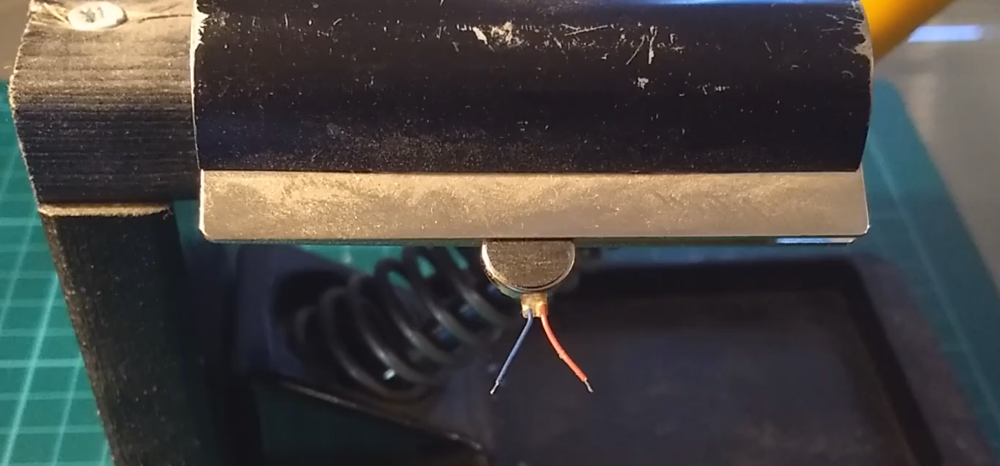
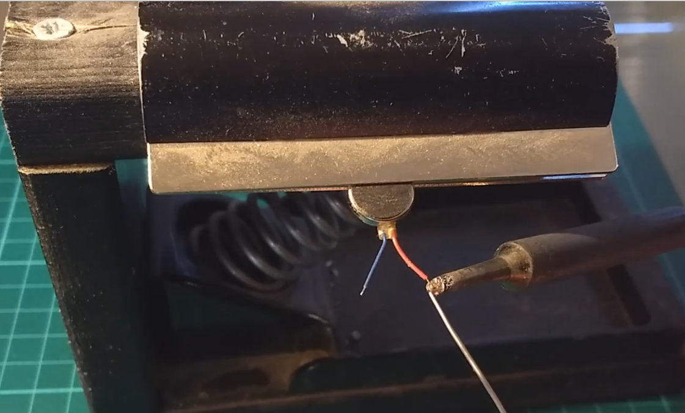
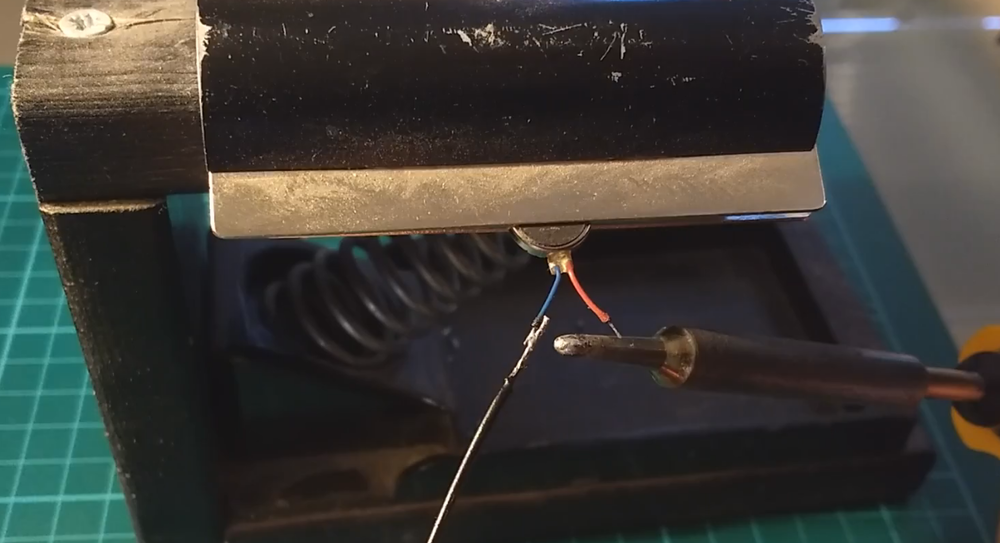
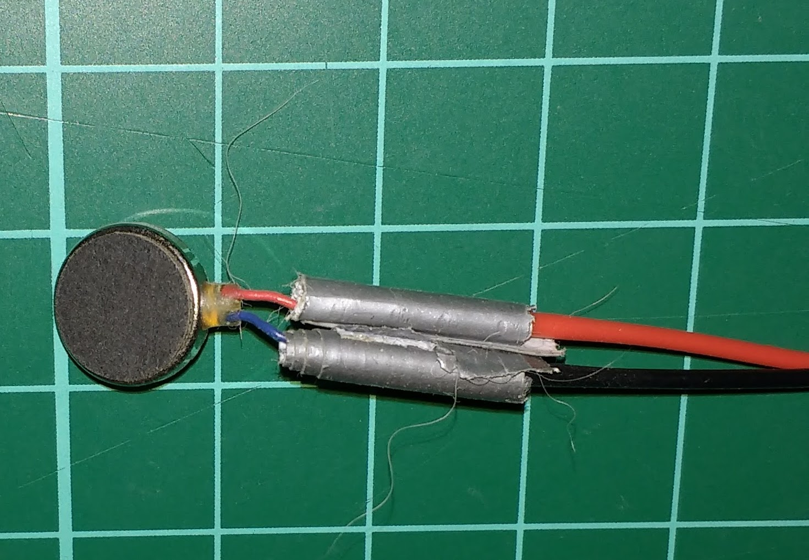
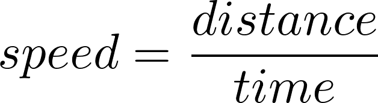
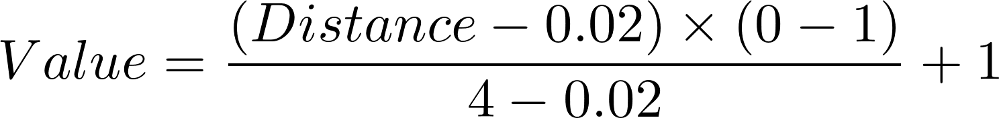
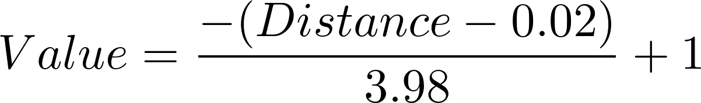

# See like a bat

In this resource you're going to make your very own echolocation system, allowing you to see in the dark.

## Adding flying leads to the vibration motor

The chances are that the vibration motor you have purchased (or scavenged) will have a pair of very short leads running from it. So the first thing you need to do is to attach some longer leads. This is usually easiest to carry out using a soldering iron, although you may get away with twisting the wires together and securing them with lots of insulating tape.

1. Take your vibration motor and secure it in place.

	

1. Use the tip of your soldering iron to heat up the ends of the leads, and then apply a little solder to both leads so they become coated in it. This is known as tinning.

	

1. Take about 60cm of red and black multi-core wire, and strip the insulating plastic from the ends of each.

1. Now tin the ends of your multi-core wire.

1. Secure your vibration motor once again, then touch the leads to the multi-core wire and apply a little heat to melt the solder they are tinned with. They should join together and form a secure bond.

	

1. Use some insulating tape or heat-shrink to wrap both wires.

	

## Testing the vibration motor

You're now going to need to test your soldering (or twisting).

1. Twist the free ends of the multi-core wire so they become fairly rigid.

1. Insert these ends into female-to-female jumper leads.

1. Place the red lead onto the 3V3 output on your Raspberry Pi.

1. Place the black lead onto any ground pin.

	

It's important to note that you can only do this with this particular motor, as it has such a small current draw. Larger motors 	should never be attached directly to the pins on your Raspberry Pi, and should instead be attached to a motor driver or a transistor.

The motor should start vibrating, at which point you can disconnect it from your Raspberry Pi.

## How an ultrasonic distance sensor (UDS) works

An ultrasonic distance sensor (UDS) works using ultrasound. This is sound with a frequency so high that humans are unable to hear it. Bats and dolphins would have no problems though, as they have evolved to be able to use sounds of this frequency.

The ultrasonic distance sensor works by sending out a burst of ultrasound. This sound will travel through air, but reflect back (echo) off hard surfaces. The sensor can detect the echo, when it returns.


By knowing the time between the outgoing burst and returning echo, and the speed of sound, you can calculate how far an object is away from the sensor.

A UDS has 4 pins:

1. Vcc is the pin that powers the device. It needs 5V to work.
2. Trig is the pin that sends out the burst. It can be triggered using 3.3V.
3. Echo is the pin that outputs when the reflected sound is received. It outputs at 5V.
4. Gnd is the ground pin, used to complete the circuit.


Here we have a problem. The echo pin is going to output 5V, but your Raspberry Pi can only receive a maximum of 3.3V through any of the GPIO pins. So in order not to fry the Pi, you're going to have to reduce that output voltage.

## Potential dividers

A potential divider can split a voltage into two smaller voltages. It does this by using resistors. Look at the diagram below. It shows a single resistor connected to 5V. The voltage across the resistor is 5V:


Now look at the diagram below. By using two resistors, the voltage can be split. As both resistors are the same, the voltage is split equally between the two:


By altering the resistors, we can tailor the voltage across any one of them to be anything we like. Here you can see that we have split the voltage to give us almost exactly 3.3V:


To work out the resistors you need, you can use the code below, or you can just use the resistances in the rest of this guide.

```python
R1 = 1200 # The smaller of the two resistors (alter this)
Vout = 3.3 # The voltage you are trying to achieve (always 3.3)
Vin = 5 # The input voltage (always 5)

R2 = (Vout * R1) / (Vin - Vout) 

print('The resistor you need is approximately',R2)
```

The resistor needed is only a rough guide. Remember, we actually only need a voltage above 1.8V to get a logical high on a GPIO pin.

## Wiring the UDS

The next stage is to set up and test the UDS. This is best done with the Raspberry Pi switched off, as you're about to use 5V, and if you accidentally short the Pi, you might have issues.

1. Start by connecting the 5V pin on the Pi into the VCC pin on the UDS.
1. The Trig pin on the UDS can go straight into GPIO 4.
1. The Echo pin on the UDS needs to go to your first resistor of the potential divider.
1. The output of the first resistor of the potential divider needs to go into GPIO 17.
1. The Gnd from the UDS can go into any ground pin on the Raspberry Pi.

The diagram below shows you the complete setup:


## Testing the UDS

You now need to make sure the UDS is working correctly. You'll need a little bit of Python 3 code to do this, so open up IDLE and create a new file called `bat.py`.

1. You're going to use GPIO Zero to code this, but the UDS isn't in the library yet. Not to worry though: you can use the default InputDevice and OutputDevice instead:

	```python
	from gpiozero import InputDevice, OutputDevice
	from time import sleep, time
	```

1. Next, you can set up the trigger and echo pins of the distance sensor:

	```python
	trig = OutputDevice(4)
	echo = InputDevice(17)

    sleep(2)
	```

	The `sleep(2)` is there to let the sensor settle itself when the program starts.

1. You can create a function to send and receive a pulse next. The first thing to do is set the trigger pin to send out a burst of ultrasound for 10μs:

	```python
	def get_pulse_time():
	   trig.on()
	   sleep(0.00001)
	   trig.off()
	```
	
1. As soon as the ultrasonic sensor has sent out a burst of sound, the echo pin is set to `high`. You can use a `while` loop to detect when this happens and then record the current time:

	```python
		while echo.is_active == False:
			pulse_start = time()

	```

1. When an echo is received, the echo pin is set to `low`. Another `while` loop will be able to record the time at which it happens:

	```python
		while echo.is_active == True:
			pulse_end = time()

	```

1. Next, you need to let the ultrasonic sleep for a little bit, and then return the length of time it took for the pulse to be sent and received:

	```python
		sleep(0.06)

		return pulse_end - pulse_start
	```
	
1. To finish off you can test the program by running it and then typing the following in the interpreter:

	```python
	print(get_pulse_time())

	```

Try typing it when your hand is close to and far from the distance sensor. You should get smaller values as your hand approaches the sensor.

## Calculating the distance

There's a simple formula for calculating the distance the sensor is from an object. You can start off with the speed equation:



This can be rearranged to make:


But you need to remember that as the sound has to travel to the object and back again, we need to divide the calculated distance by 2. Therefore:


The speed of sound in air will vary depending on the temperature and air pressure, but it tends to hover around 343ms<sup>-1</sup>.

We can write a simple Python function to calculate this for us:

```python
def calculate_distance(duration):
    speed = 343
    distance = speed * duration / 2 # calculate distance in metres
    return distance
```
		
To test everything is working, we can add an infinite loop at the bottom of the script. Your full code listing should now look like this:

```python
from gpiozero import InputDevice, OutputDevice
from time import sleep, time

trig = OutputDevice(4)
echo = InputDevice(17)

sleep(2)

def get_pulse_time():
    trig.on()
   	sleep(0.00001)
	trig.off()

	while echo.is_active == False:
		pulse_start = time()

	while echo.is_active == True:
		pulse_end = time()

	sleep(0.06)

	return pulse_end - pulse_start

def calculate_distance(duration):
	speed = 343
	distance = speed * duration / 2
	return distance

while True:
	duration = get_pulse_time()
	distance = calculate_distance(duration)
	print(distance)
```
Run your code and you should see a stream of numbers, showing you the distance from the sensor in metres. Move your hand closer to and further from the distance sensor.

## Adding the Vibration motor

You can now add your vibration motor to GPIO 14 and a ground pin:


1. You'll want to drive the motor using Pulse Width Modulation (PWM); this will send pulses of current to the motor. The faster the pulse, the quicker the motor will vibrate. Alter your code to use the `PWMOutputDevice` from `gpiozero` and set up the motor on GPIO 14:

	```python
	from gpiozero import InputDevice, OutputDevice, PWMOutputDevice
	from time import sleep, time

	trig = OutputDevice(4)
	echo = InputDevice(17)
	motor = PWMOutputDevice(14)

	sleep(2)

    ```

1. A `PWMOutputDevice` needs a floating point number between 0 and 1, so you need to remap the distance to a value between 0 and 1. At a maximum of 4m you want a value of 0, while at a distance of 2cm you want a value of 1. You can remap the maximum and minimum distances to minimum and maximum values using the equation below:

	

1. Now we can plug in the maximum and minimums:

   

1. And finally simplify the equation a little:

   

1. Turning this into a Python function you get:

	```python
	def calculate_vibration(distance):
		vibration = (((distance - 0.02) * -1) / (4 - 0.02)) + 1
		return vibration

	```

1. Finally, you can alter your `while` loop to drive the motor:

	```python
	while True:
		duration = get_pulse_time()
		distance = calculate_distance(duration)
		vibration = calculate_vibration(distance)
		motor.value = vibration

	```
	
Run the code and move your hand closer to and further away from the sensor. The motor should vibrate according to the distance your hand is away from it.

## Debugging your script

There are a few reasons you might encounter errors with your script:

1. The `get_pulse_time` function can occasionally fail due to problems with the cycle of trigger and echo on the ultrasonic distance sensor. You might like to change it to handle these issues, by using a `try/except` to catch either of the variables not being stored:

	```python
	def get_pulse_time():
		trig.on()
		sleep(0.00001)
		trig.off()

		while echo.is_active == False:
			pulse_start = time()

		while echo.is_active == True:
			pulse_end = time()

		sleep(0.06)

		try:
			return pulse_end - pulse_start
		except:
			return 0.02
    ```

1. The maximum range on the UDS might not reach 4m. The one used in writing this resource never went beyond 2m. You can alter the `calculate_vibration` function to use a different maximum if you like. For instance:

	```python
	def calculate_vibration(distance):
		vibration = (((distance - 0.02) * -1) / (2 - 0.02)) + 1
		print(vibration)
		return vibration
	```

1. Occasionally, a number that the PWMOutputDevice can't handle might be returned by the `calculate_vibration` function. Another `try/except` in the final loop will handle this:

   ```python
   while True:
	   duration = get_pulse_time()
	   distance = calculate_distance(duration)
	   vibration = calculate_vibration(distance)
	   try:
		   motor.value = vibration
	   except:
		   pass

   ``` 

## Taking it further

Now move on to [worksheet 2](worksheet2.md) to learn how to incorporate all of this into a wearable device.
