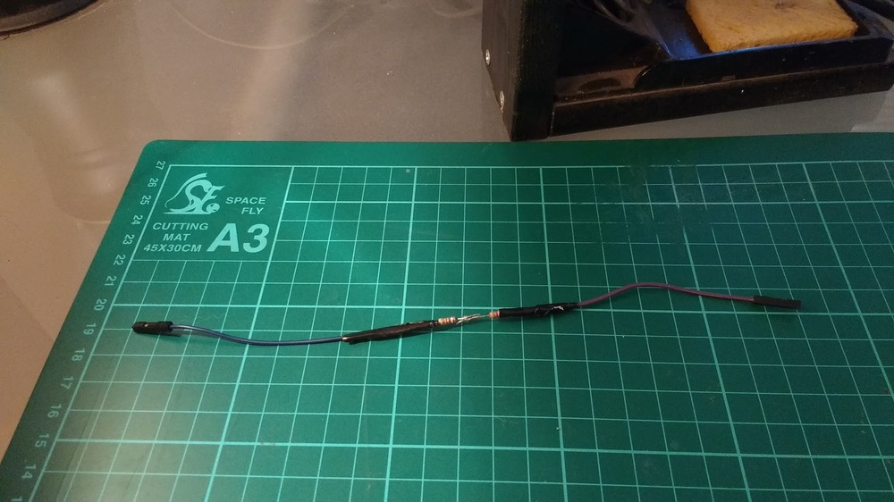
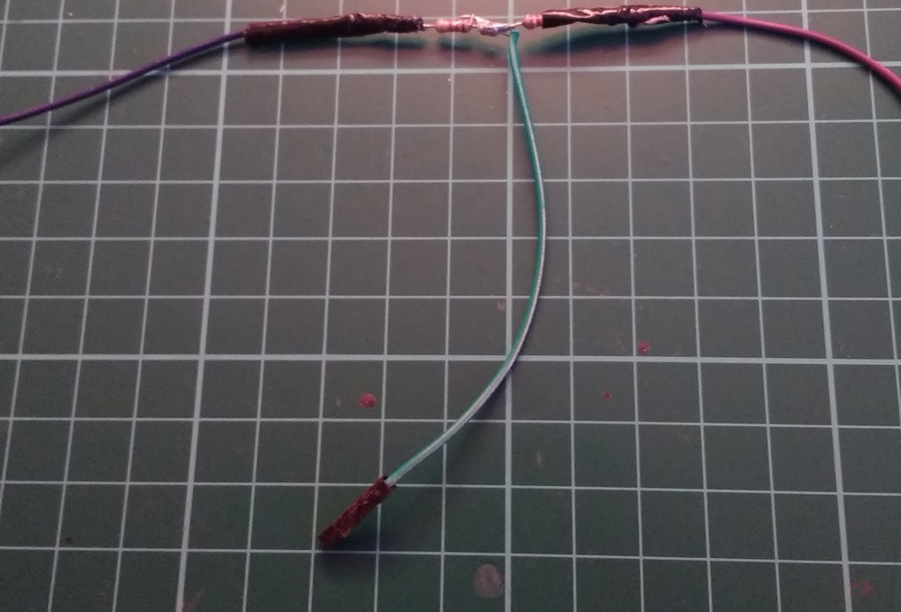
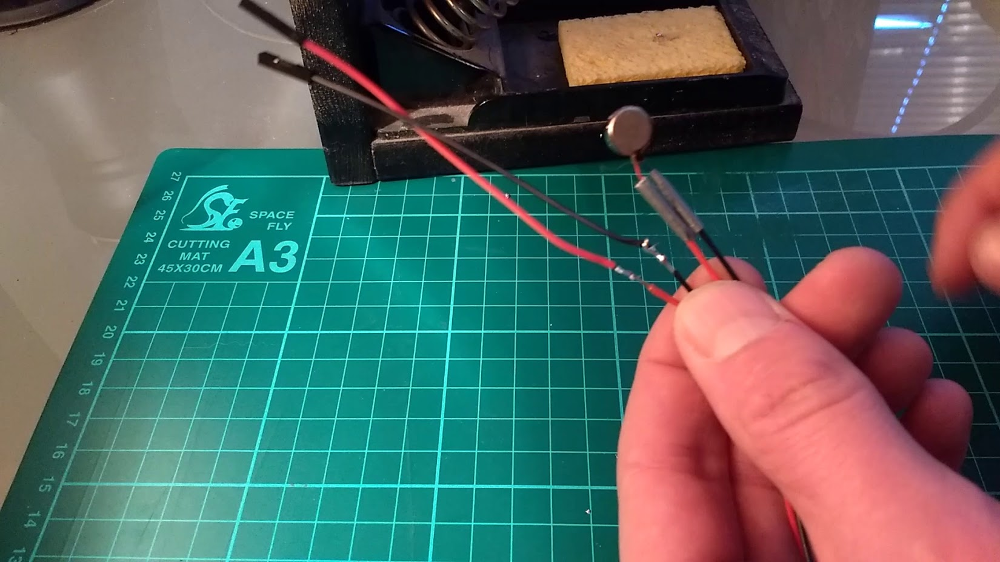
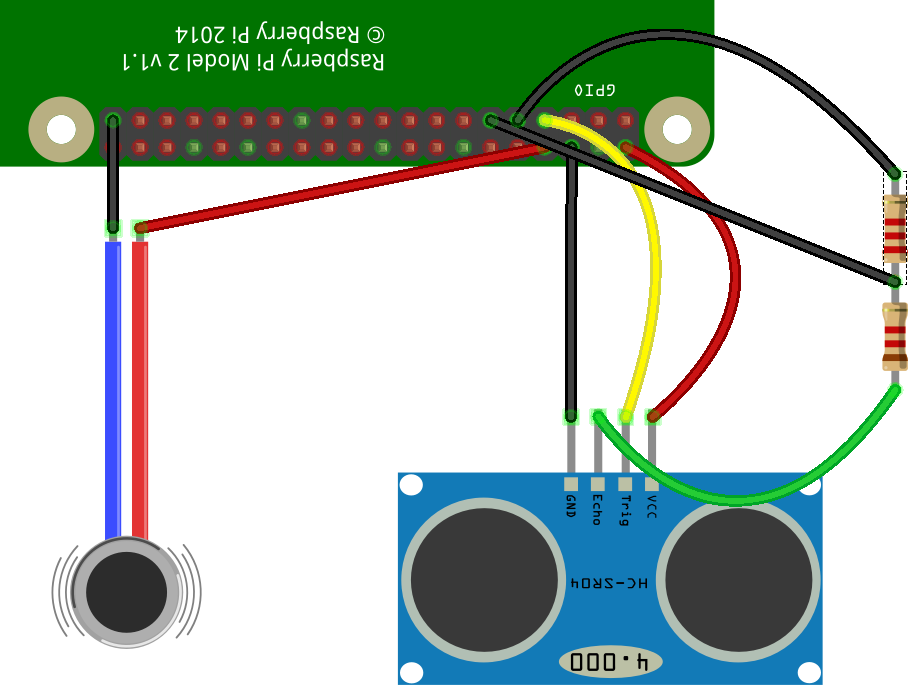
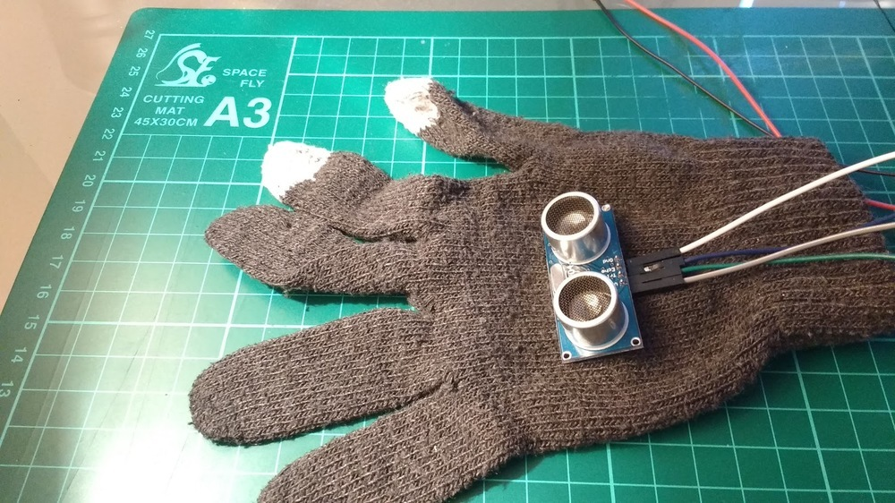
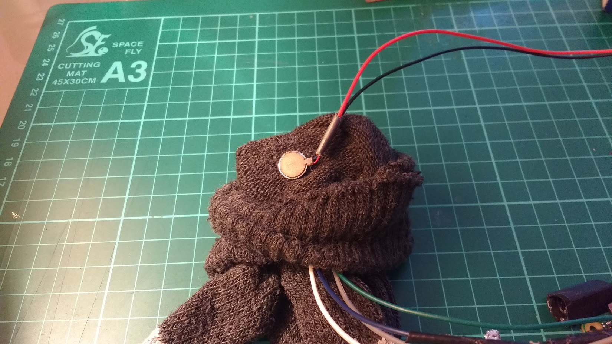
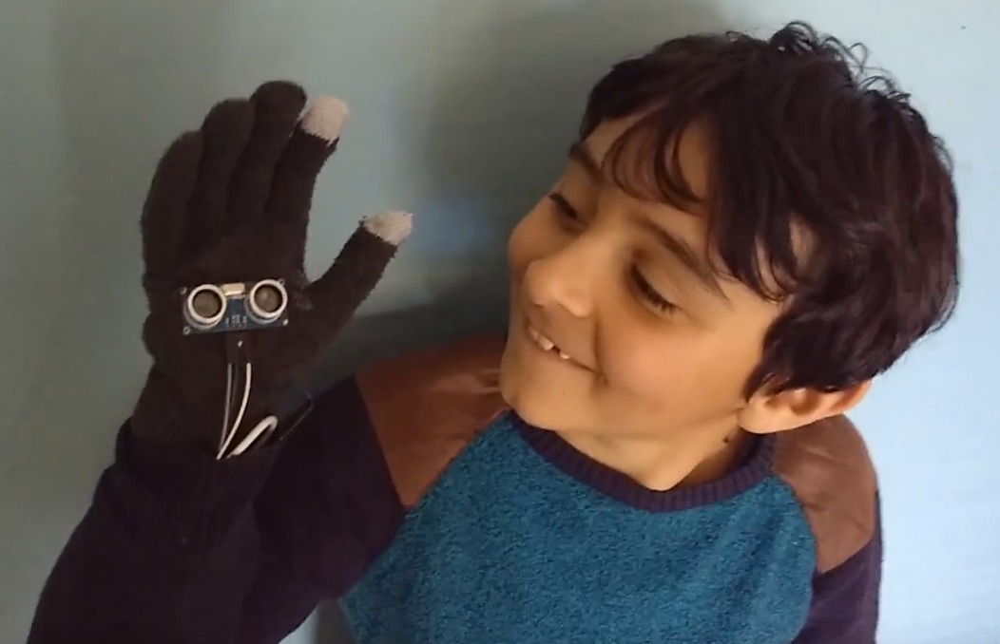

# See like a Bat

In the second section of this worksheet, you're going to incorporate your device into a glove, to allow you to navigate around like a bat!

## The First Step

1. The first thing to do is to solder the pair of resistors together, and then add female jumper leads to each end of the pair. Add tape or heat-shrink to secure and insulate the joins.

	

1. Next add a third female header lead to the join between the two resistors. This can then be taped up as well.

    

	1. The lead that joins to the smaller of the two resistors needs to go into the Echo pin on the UDS.
	1. The lead that branches out from between the sensors must go into GPIO 17
	1. The lead that comes out of the larger of the two resistors must go into a ground pin on the Raspberry Pi.
	1. All the other connections are the same as the previous setup.

1. Header leads also need to be attached to the vibration motor.

    

1. Lastly you can connect it all to either your Raspberry Pi, or, even better, to a Pizero.

    

1. This wiring diagram may help you.

    

1. Run your `bat.py` script to test that everything is working correctly.

1. If it's not working as expected, have a look at the debugging section in the [previous worksheet](worksheet.md)

## Making it wearable

To finish off you can make your device into a wearable.

1. Sew or glue the ultrasonic distance sensor to the palm side of a glove.

	

1. Sew or glue the vibration motor to the inside of the glove, so it rests on the palm

	

1. Place the Raspberry Pi or Pizero up your along with a battery, and secure it in place with a wrist band.

	

1. Now you should be able to hold up your hand and detect objects that come close to you, or that you come close to.

## Taking it further

1. Why not make a second one, so that you can have a pair of gloves and have binocular bat vision?

2. Try playing around with the mathematics of turning distance into a vibration intensity. Can you make the device more sensitive at closer distances?

3. Why not sew a UDS into the collar of a jacket, so you can detect when someone is sneaking up on you from behind?
